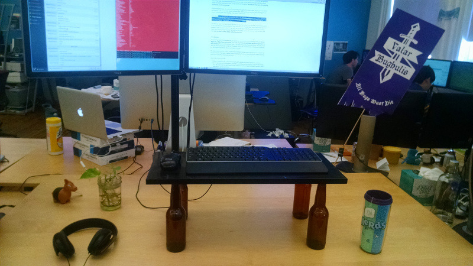
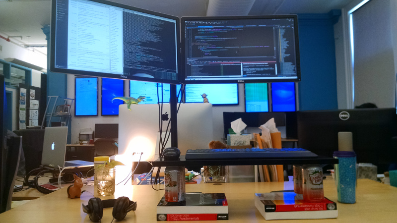
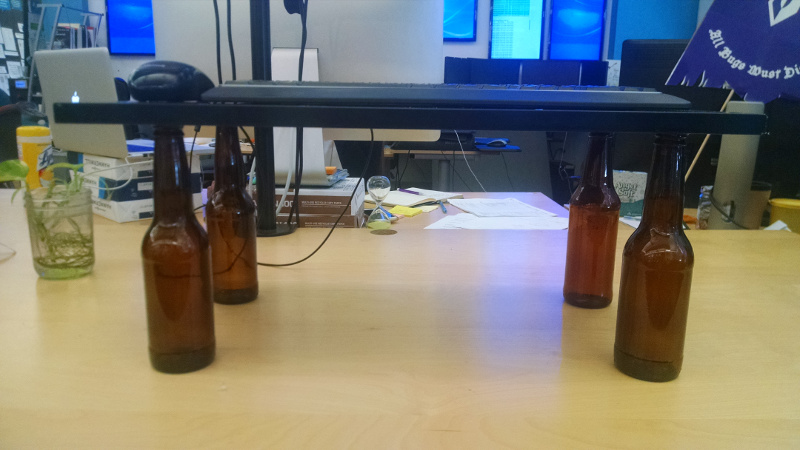

# Standing Desk

## Materials

- A desk
- Monitor arm(s)
- 4 glass bottles (depending on the height of the desk, you can use smaller or larger ones)
- A wooden plank (big enough to place keyboard and mouse)
- Glue

## Process

My first attempt worked just fine, but was kind of ugly. 4 soda cans and some books allowed me to try out the concept and adjust the height until I got it right:

Later, I just glued 4 bottles to the plank, waited until the glue dried, and used it as a platform for the keyboard and mouse

Depending on your monitor preferences, you can use arms for 1, 2 or 4 monitors.

## Gotchas

- Play around with different bottle heights until you hit the ones that are best for you. Remember that your elbows should bend at a 90° angle.
